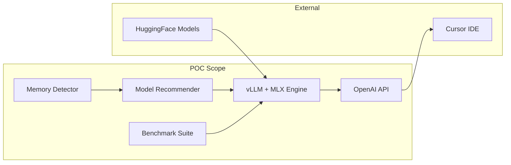

# vLLM-MLX POC: Proving Efficient Local Inference

## Goal

Prove that **vLLM with MLX backend** is more efficient and faster than running MLX models directly, specifically for:
- Single prompt latency (time to first token, tokens/sec)
- Concurrent prompt throughput (multiple simultaneous requests)

## POC Architecture



## Stages Overview

| Stage | Objective | Tests |
|-------|-----------|-------|
| 1 | Memory detection and model recommendation (70/30 split) | 4 unit tests |
| 2 | vLLM + MLX core engine | 4 integration tests |
| 3 | Benchmark suite proving efficiency | 6 benchmark tests |
| 4 | Cursor integration via OpenAI API | 6 E2E tests |

See individual stage files for detailed TDD steps:
- [Stage 1: Memory Detection](stage1-memory.md)
- [Stage 2: vLLM+MLX Engine](stage2-engine.md)
- [Stage 3: Benchmarks](stage3-benchmarks.md)
- [Stage 4: Cursor Integration](stage4-cursor.md)

## Project Structure (POC)

```
vllm-mlx-local/
├── .cursorrules            # Project rules
├── pyproject.toml
├── README.md
├── planning/               # Planning documents
│   ├── README.md
│   ├── plan.md
│   ├── stage1-memory.md
│   ├── stage2-engine.md
│   ├── stage3-benchmarks.md
│   └── stage4-cursor.md
├── src/
│   └── vllm_mlx/
│       ├── __init__.py
│       ├── memory.py       # Stage 1
│       ├── models.py       # Stage 1
│       ├── engine.py       # Stage 2
│       ├── benchmark.py    # Stage 3
│       └── server.py       # Stage 4
└── tests/
    ├── conftest.py
    ├── test_stage1_memory.py
    ├── test_stage2_engine.py
    ├── test_stage3_benchmarks.py
    └── test_stage4_cursor.py
```

## Dependencies (Minimal for POC)

```toml
[project]
dependencies = [
    "mlx>=0.18.0",
    "mlx-lm>=0.18.0",
    "fastapi>=0.111.0",
    "uvicorn>=0.30.0",
    "psutil>=5.9.0",
    "httpx>=0.27.0",
    "pytest>=8.0",
    "pytest-asyncio>=0.23",
]
```

## Success Criteria

The POC is successful if:

1. Memory detection correctly identifies total and available unified memory
2. Model recommendation follows 70/30 split and selects appropriate model
3. **Benchmark shows vLLM+MLX matching or exceeding vanilla MLX performance**
4. Server runs on `http://127.0.0.1:52198` and responds to OpenAI API calls
5. Cursor can connect and generate code completions

## Future Improvements (Out of POC Scope)

| Feature | Description | Why Deferred |
|---------|-------------|--------------|
| CLI Tool | `vllm-mlx init/serve/status` commands | POC can use Python scripts directly |
| Config File | `~/.vllm-mlx/config.yaml` persistence | POC uses hardcoded/CLI args |
| Auto-download | HuggingFace download with progress bar | Manual download acceptable for POC |
| FIM Support | Fill-in-Middle code completion | Chat/completion sufficient for POC |
| Dynamic KV | Runtime KV cache resizing | Static allocation for POC |
| DeepSeek Models | DeepSeek-Coder-V2-Lite support | Qwen2.5 sufficient to prove concept |
| Streaming | SSE token streaming | Full response OK for benchmarks |
| Concurrency >4 | High concurrent request handling | 2-4 concurrent sufficient for POC |
| Graceful Degradation | Auto-reduce context on memory pressure | Manual restart acceptable |
| launchd Integration | Background daemon service | Manual server start for POC |
